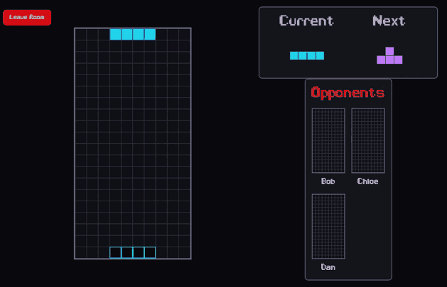
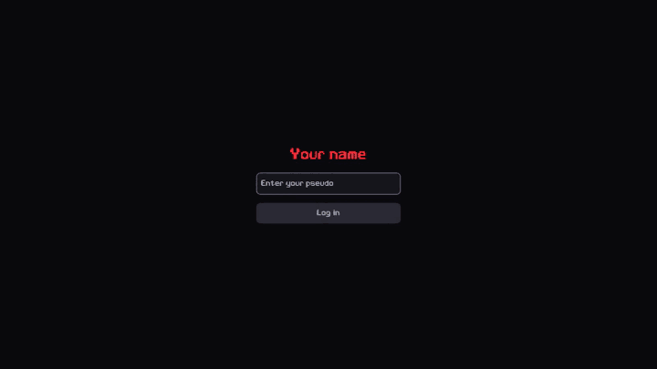
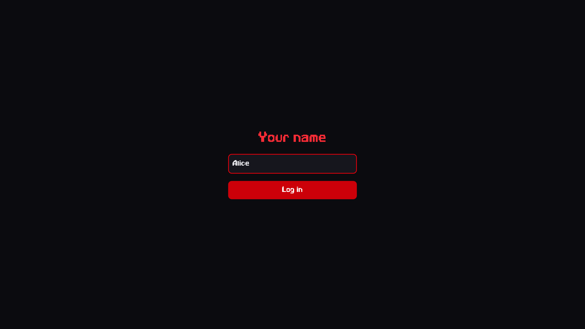
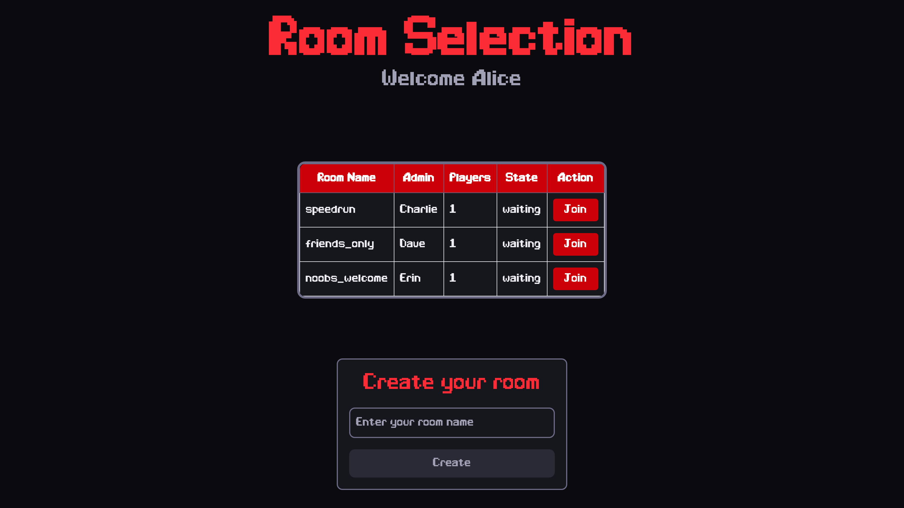
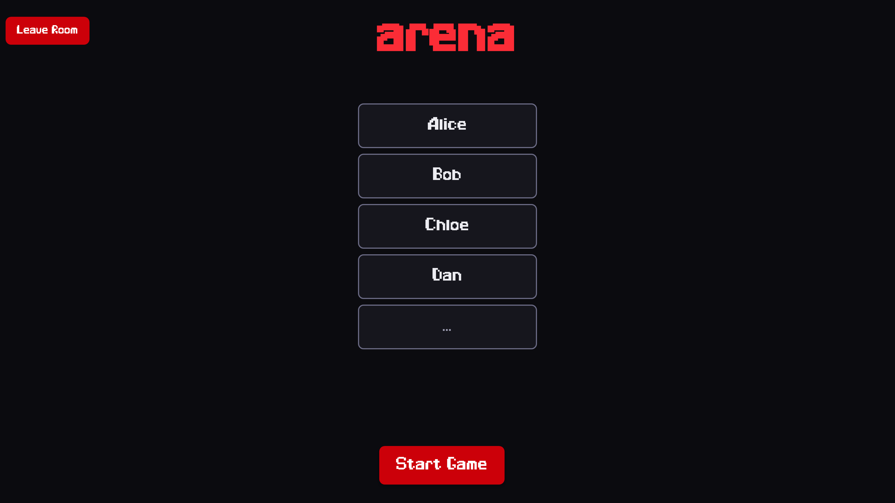
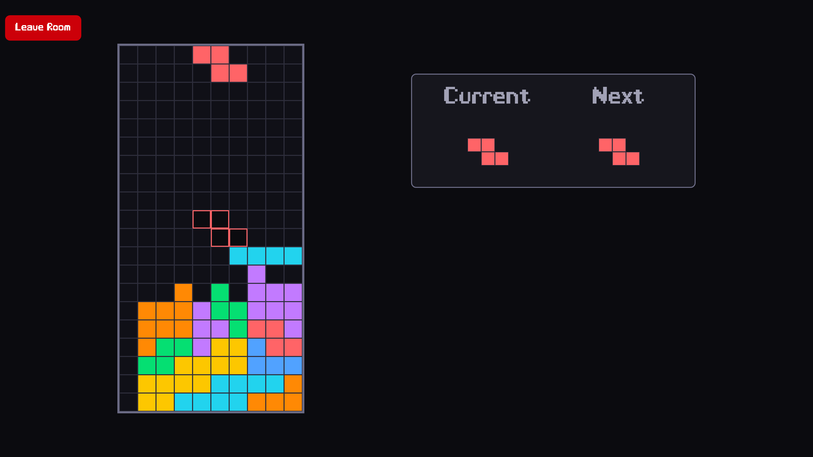
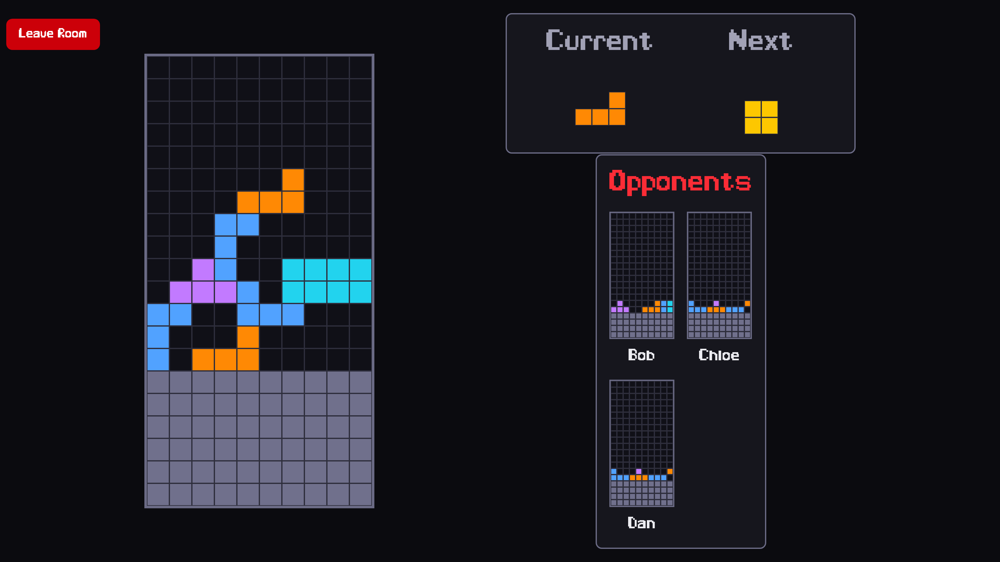

# red-tetris 🎮

<p align="center">
  
</p>

## 📝 Description

Red Tetris is a multiplayer Tetris game. The game can be played solo or with multiple players, each having their own playing field. All players receive the same sequence of pieces, and destroying lines in your field sends penalty lines to opponents. The last player standing wins.

### Key Features:

- **Front-end**: Built with React, providing an intuitive and responsive user interface.
- **State Management**: Utilizes Redux Toolkit for efficient state management.
- **Back-end**: Developed using Node.js with Express, managing game logic and player interactions.
- **Functional Programming**: The client code avoids using "this" to promote functional constructs.
- **Asynchronous Communication**: Implements socket.io for real-time, bidirectional communication between clients and the server.
- **Unit Tests**: Ensures robust code with at least 70% coverage of statements, functions, lines, and 50% of branches.

## 🕹️ How to play

Pick a name, join or create a room, and wait for the others. The player who created the room is the admin and is the only one who can start the game.

<p align="center">
  
</p>

### Controls

| Key | Action |
| --- | --- |
| <kbd>←</kbd> / <kbd>→</kbd> | Move the piece sideways |
| <kbd>↓</kbd> | Soft drop (one row down) |
| <kbd>↑</kbd> | Rotate |
| <kbd>Space</kbd> | Hard drop |

### Rules

- A room holds up to **5 players**. Names and room names accept letters, digits and `_`, up to 15 characters.
- Every player in a room gets the **same sequence of pieces**, so nobody gets a luckier board.
- Clearing `n` lines sends `n` **penalty lines** to every opponent — they push your stack up and cannot be cleared.
- The pieces fall faster as the game goes on: the tick starts at 3s and speeds up every 8 turns, down to 0.5s.
- The **last player standing wins**, and the winner's name is highlighted in the waiting room for the next round.
- A room can be joined directly by its URL: `http://localhost:5173/<room_name>/<player_name>`.

## 📸 Screenshots

<table>
  <tr>
    <td width="50%"></td>
    <td width="50%"></td>
  </tr>
  <tr>
    <td align="center"><b>Login</b> — pick the name you will play under</td>
    <td align="center"><b>Lobby</b> — join an open room or create your own</td>
  </tr>
  <tr>
    <td width="50%"></td>
    <td width="50%"></td>
  </tr>
  <tr>
    <td align="center"><b>Waiting room</b> — the admin starts the game</td>
    <td align="center"><b>Solo</b> — the board, the current and next pieces</td>
  </tr>
</table>

<p align="center">
  
</p>
<p align="center">
  <i>Multiplayer — opponents' boards on the right, and the grey penalty lines they just sent.</i>
</p>

## 📦 Installation

### Development

```bash
docker compose --profile dev up --build
```

- Frontend: [http://localhost:5173](http://localhost:5173)
- Backend: [http://localhost:4000](http://localhost:4000)

Hot reload is enabled on both sides.

---

### Production

```bash
docker compose --profile prod up --build
```

In this mode, the server will serve both the API and the static files generated by the frontend build.

- The frontend is built first.
- The server serves the built frontend as static files.
- The app is available at: http://localhost:4000

## 🧪 Tests

The game logic is covered by Jest, from the server folder:

```bash
cd server
npm test              # run the suite
npm test -- --coverage  # run it with the coverage report
```

Coverage thresholds are enforced in `server/jest.config.js`: 70% of statements, functions and lines, and 50% of branches.

## 🛠️ Tech stack

| Layer | Stack |
| --- | --- |
| **Client** | React 19, React Router 7, Redux Toolkit, Tailwind CSS 4, Vite |
| **Server** | Node.js, Express 4, socket.io 4 |
| **Tests** | Jest, Babel |
| **Tooling** | Docker, Docker Compose |

## 📁 Project structure

```
client/
  app/
    components/   Board, Cell, OpponentsBoard, WaitingRoom, ...
    redux/        store, socket middleware, room + socket slices
    routes/       login, rooms, game
server/
  app/
    GameServer.js  rooms and players registry
    Room.js        one room, its players and its game
    Game.js        game loop, piece sequence, penalties
    Player.js      a player's board and moves
    Board.js       grid, collisions, line clearing
    Tetrimino.js   shapes and rotations
  index.js         express + socket.io entry point
```

# 🧑 Authors ‍

- [@thoberth](https://github.com/thoberth)
- [@tsannie](https://github.com/tsannie)
